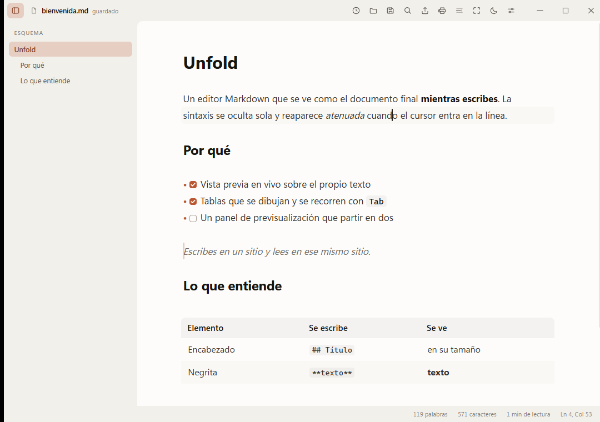
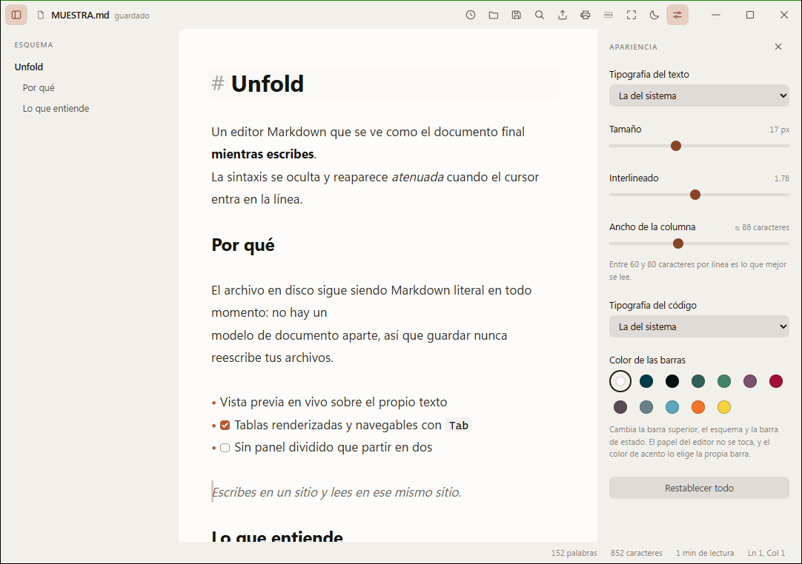

<div align="center">

# Unfold

**Un editor Markdown donde el documento se ve como quedará mientras lo escribes.**

Sin panel dividido, sin previsualización aparte. Escribes en un sitio y lees en ese mismo sitio.

[Descargar para Windows](https://github.com/esdrasclth/unfold/releases/latest) ·
[unfold.brandsofts.com](https://unfold.brandsofts.com/) ·
[GitHub integrado](#github-integrado) ·
[Cómo funciona](#cómo-funciona) ·
[Contribuir](CONTRIBUTING.md)



</div>

---

## Qué lo diferencia

**Tus archivos no cambian.** El editor no mantiene un modelo de documento aparte
del texto: el buffer contiene siempre Markdown literal. Guardar escribe lo que
ya había, así que abrir un `.md` con Unfold nunca reordena tus listas ni
normaliza tus comillas.

**Arranca en 250 ms y ocupa 5 MB.** Está hecho con Tauri, que usa el WebView2
que Windows ya trae, en vez de empaquetar un navegador entero.

**Se edita donde se lee.** Al poner el cursor en una línea, sus marcadores
reaparecen —atenuados, para no dar un tirón visual— y puedes editarlos. Al
salir, vuelven a ocultarse.

**Tu documentación, donde ya vive.** Conecta repositorios de GitHub, ábrelos
desde un explorador con árbol y búsqueda, y publica tus cambios sin salir del
editor.

<details>
<summary>Ver en tema oscuro</summary>



</details>

## Instalar

Descarga **`Unfold-Setup.exe`** de la [última versión](https://github.com/esdrasclth/unfold/releases/latest)
y ábrelo. Necesitas Windows 10 o 11.

Se instala para tu usuario, sin pedir permisos de administrador, y a partir de
ahí la propia aplicación te avisa cuando hay una versión nueva.

> **Windows mostrará un aviso de SmartScreen** la primera vez. El instalador no
> está firmado con un certificado comercial, que cuesta unos cientos de euros al
> año. Pulsa «Más información» → «Ejecutar de todas formas». Puedes comprobar
> que el archivo es el mismo que publicamos comparando su hash con el de la
> release.

## Qué sabe hacer

Además, Unfold restaura la sesión (pestañas, borradores, cursor y posición) al
volver a abrirlo. El menú contextual del editor reúne las construcciones
Markdown disponibles y `Ctrl+Shift+M` alterna el modo Código fuente.

- **Vista previa en vivo** de encabezados, negrita, cursiva, tachado, código,
  citas, listas, tareas, reglas e imágenes
- **Tablas renderizadas** y navegables con `Tab`, sin salir del Markdown
- **Fórmulas** `$…$` y `$$…$$` con KaTeX, y **frontmatter YAML** como ficha de
  metadatos
- **Pestañas** con su propio historial de deshacer, y archivos recientes
- **Esquema lateral** plegable y ajustable, sacado del árbol sintáctico
- **Pegar desde el navegador** convierte el HTML a Markdown; pegar una imagen la
  guarda junto al documento
- **Exportar** a HTML autocontenido y a PDF
- **Vigila el archivo**: si lo editas desde otro programa, avisa en vez de
  pisarlo
- **Apariencia configurable**: tipografía, tamaño, interlineado, ancho de
  columna y doce colores de barra
- **Repositorios de GitHub**: explorador con árbol de carpetas, búsqueda por
  nombre e indicadores de estado por documento
- **Confirmar y publicar** desde la aplicación, sincronizando antes con el
  remoto
- **La ventana te recuerda**: vuelve con el tamaño, el sitio y el estado
  maximizado con los que la dejaste
- Corrector ortográfico, modo enfoque y modo máquina de escribir

## Atajos

| Acción | Atajo |
| --- | --- |
| Nuevo · Abrir · Guardar | `Ctrl+N` · `Ctrl+O` · `Ctrl+S` |
| Cerrar pestaña · Cambiar de pestaña | `Ctrl+W` · `Ctrl+Tab` |
| Negrita · Cursiva · Código · Tachado | `Ctrl+B` · `Ctrl+I` · `Ctrl+E` · `Ctrl+Shift+X` |
| Enlace · Seguir un enlace | `Ctrl+K` · `Ctrl` + clic |
| Encabezado 1–6 · Quitar | `Ctrl+1` … `Ctrl+6` · `Ctrl+0` |
| Buscar y reemplazar | `Ctrl+F` |
| Acercar · Alejar el contenido | `Ctrl++` · `Ctrl+-` |
| Esquema · Apariencia | `Ctrl+Shift+O` · `Ctrl+,` |
| Repositorios · Cuenta de GitHub | `Ctrl+Shift+B` · `Ctrl+Shift+H` |
| Exportar HTML · Imprimir o PDF | `Ctrl+Shift+E` · `Ctrl+P` |
| Modo enfoque · Máquina de escribir | `Ctrl+Shift+F` · `Ctrl+Shift+T` |
| Código fuente · Menú Markdown | `Ctrl+Shift+M` · clic derecho |
| Pegar sin formato | `Ctrl+Shift+V` |
| En tablas: celda · fila | `Tab` / `Shift+Tab` · `Enter` |

## GitHub integrado

Unfold conecta con GitHub mediante una **GitHub App** y el flujo de dispositivo:
autorizas un código de ocho caracteres en `github.com` y la sesión se guarda en
el Administrador de credenciales de Windows, cifrada por el sistema. El token
nunca llega al frontend, ni al `localStorage`, ni a la URL del remoto, y se
renueva solo antes de caducar.

Los permisos son los mínimos que hacen falta: `Contents` de lectura y escritura,
y `Metadata` de lectura. Nada más.

**Sólo ve lo que le concedas.** Una GitHub App no puede ampliarse el acceso a sí
misma: eliges en GitHub a qué repositorios entra, y puedes cambiarlo cuando
quieras. Unfold detecta si el acceso está limitado y te lleva a la pantalla
correcta.

### Qué puedes hacer

- **Conectar repositorios**, que se clonan en `%LOCALAPPDATA%\com.esdras.unfold`
  y quedan disponibles sin conexión.
- **Explorarlos** con `Ctrl+Shift+B`: árbol de carpetas, búsqueda por nombre
  —insensible a mayúsculas y tildes— y un indicador por documento que distingue
  sincronizado, modificado, nuevo y en conflicto.
- **Traer cambios** del remoto, con avance rápido cuando se puede hacer sin
  inventar nada.
- **Confirmar y publicar**: marcas qué archivos entran, escribes el mensaje, y
  Unfold confirma, sincroniza con el remoto y publica.
- **Crear documentos** dentro de la copia local, sin salir del explorador.

### Lo que todavía no hace

**No fusiona.** Si alguien publica en la misma rama entre tu última
sincronización y la tuya, el commit se crea y ahí se detiene, avisando de que
hay que integrar los cambios con Git. Tampoco hay ramas ni pull requests.

Los detalles de cada decisión están en `docs/GITHUB_PHASE_0.md` … `_4.md`.

## Cómo funciona

El buffer de CodeMirror contiene el Markdown tal cual. Un plugin recorre el
árbol sintáctico **de la parte visible** y oculta los marcadores (`##`, `**`,
`` ` ``, `>`, `-`) con decoraciones, aplicando al texto el estilo que
corresponde. Cuando la selección toca un elemento, sus marcadores vuelven a
mostrarse para poder editarlos.

Sólo se decora el rango visible, y sólo se recalcula cuando cambia el texto, el
viewport o la selección. Por eso sigue siendo fluido en archivos grandes.

Hay dos excepciones que no caben en ese esquema. Las **tablas** y las
**fórmulas de bloque** se sustituyen por HTML real, y eso altera la altura de
las líneas; CodeMirror no admite decoraciones de bloque desde un plugin de
vista, así que viven en un `StateField`.

El **frontmatter** también se trata aparte, porque para Markdown no existe: la
primera raya `---` es una regla horizontal y la de cierre convierte lo de en
medio en un encabezado subrayado.

## Desarrollo

Necesitas Node.js 22.18 o superior y Rust con toolchain MSVC.

```powershell
npm install
npm start     # aplicación nativa con recarga en caliente
npm test      # pruebas de regresión, sin abrir la app
```

Para iterar sólo en la interfaz, `npm run dev` levanta Vite en el navegador; ahí
abrir y guardar usan la File System Access API en lugar del sistema de archivos.

En [CONTRIBUTING.md](CONTRIBUTING.md) están la estructura del proyecto, cómo
compilar los instaladores y las convenciones del código.

## Contribuir

Se aceptan issues y pull requests. Si vas a meterte con algo grande, abre antes
un issue para comentarlo.

Lo que está pendiente y sería bienvenido:

- Fusionar historias divergentes al publicar, y resolver conflictos
- Ramas y pull requests desde la aplicación
- Ver el diff de cada archivo antes de confirmar
- Notas al pie y enlaces automáticos
- Tablas dentro de citas o listas
- Compilaciones para macOS y Linux

## Licencia

MIT. Puedes usar, modificar y distribuir el código, incluso comercialmente,
conservando el aviso de copyright. Ver [LICENSE](LICENSE).
